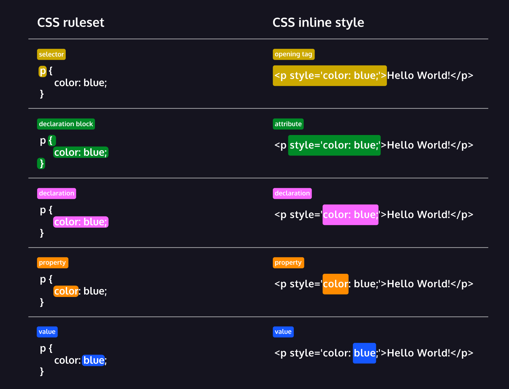

# CSS

Cascading Style Sheets - A language to style HTML to make the webpage more visually apealing.

## Syntax

Two types of syntax:

1. ruleset

2. inline (in html)

Using the selector element it will style all the same elements in de html file the same?? Maybe



### Internal style sheet

The internal style sheet is used to do styling as a ruleset within the head of the html file instead of its own file. In the following example all paragraph elements will be styled the same way in the html file.

```cshtml
<head>
    <style>
        p {
            color: red;
            font-size: 20px;
        }
    </style>
</head>
```

### Universal selector

`*` targets all elements of any type

### Targeting html element attributes

#### class

To target an element with a certain clas attribute instead of all of the same element you use a dot.

```cshtml
<p class="name"></p>

.name {

}
```

A class attribute inside an html element can reference different class names bu seperation of spaces. 

#### id

The id is targeted with a hashtag and can only hold one name, unlike the class attribute.

```cshtml
<p id="name"></p>

#name {

}
```

Styling by targeting the id overrides other style choices made by other style selectors.

#### Other attributes

[href] - to target al of an attribute

`type[attribute*=value]` to target a specific attribute within an certain element type.

### Pseudo-selectors

Pseudo-selectors are classes you can add after an selector and defines what happens to that selector with certain actions. They are added to an selector with `:`.

Examples:

- :focus

- :visited

- :disabled

- :active

- :hover

```cshtml
p:active {
    /* content */
}
```

### Chaining

#### Multiple rules as selector

`h1.special {}` targets headers 1 with a class named special

#### Multiple selectors

You devide multiple selectors with a `,`

`.class1, .class2 {}`

`#id1, #id2, #etc {}`

### Descendant combinator

## Linking a CSS file in the html fyle

```html
<head>
    <link href="address_or_path" rel="relationship_between files">
</head>
```

The relationship between files in this case is "stylesheet".

You can link a stylesheet with an url, but how did the stylesheet get there, is the question.

## CSS style options

[CSS Reference](https://www.w3schools.com/cssref/index.php)

### Dynamic scaling to screen

```cshtml
  <head>
    <meta name="viewport" content="width=device-width, initial-scale=1.0" />
  </head>
```
