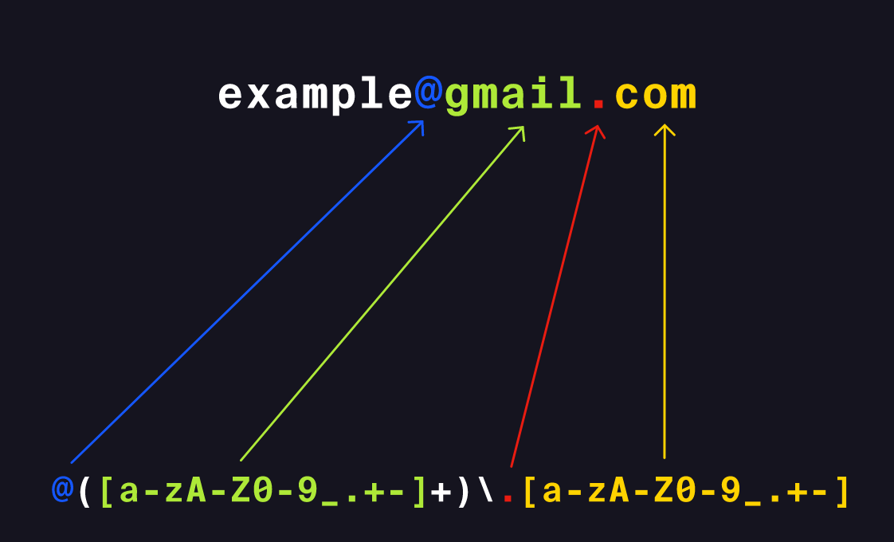

# Regex

Regular Expressions - is a pattern represented by a sequence of characters. It can be used to perform **text search** and **text replace** operations.

A search pattern that can be used to search for things in a string.

Regex categories:

- Character Classes and Capture Groups

- Escaped Characters - ontsnapt?

- Quantifiers - kwantificatie is in nummer om te zetten

- Alternation - afwisseling

## syntax (in javascript)

`/search/` = the characters that you are trying to match exactly

`/search|multiple|words/` `|` = a pipeline, idk

`[]` = character class

### flags

Flags are added behind the search /search/flag

i = ignore case

g = find every recuring case of the search

### Other notes

A period in a search is a wildcard character. It can stand for anything outside a character class

`/se./` - searches for any word that starts with se

match from a pre-defined characters encased within []

`/b[aiu]g/` - matches with bag, big and bug

matching a range

`/[a-z]/` - matches all letters in the alphabet individually

`/[2-6]/` - matches a range of numbers 2 to 6

`/[2-6h-s]/` - matches the number range and a letter range

### Exceptions

`^` indicates that you should match anything except the characters after the symbol

`/[^0-9]/` - matches all characters except numbers

### Uccurs one or more times

 `+` extracts multiple of the same character if they are in sequence in the string

`/s+/g` on "mississipi" extracts "ss" and "ss"

### zero or more times

`*` matches zero or more times. Is a little bit of a mind fuck but

`/go*/` matches anything that starts with g and then the zero or more o's that come after.

### At most one time

`?` says to match once at most. So zero or one time.

### Greedy and lazy matches

A greedy match finds the longest possible part of a string that fits the search

A lazy match returns the smallest possible part of a string that fits the search

Example: we're searching in the string "titanic"

`/t[a-z]*i/` returns "titani", because it searches for the longest possible match starting with t and ending with i

`/t[a-z]*?i/` returns "ti", because
