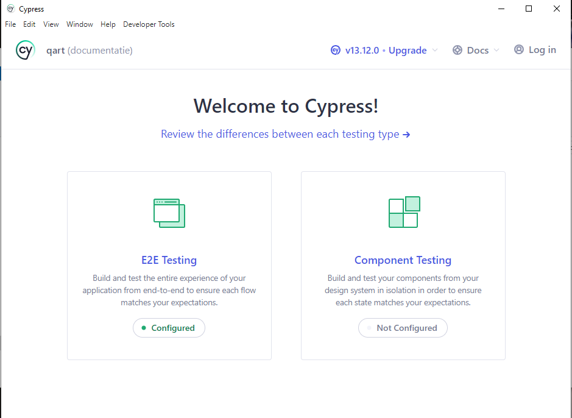
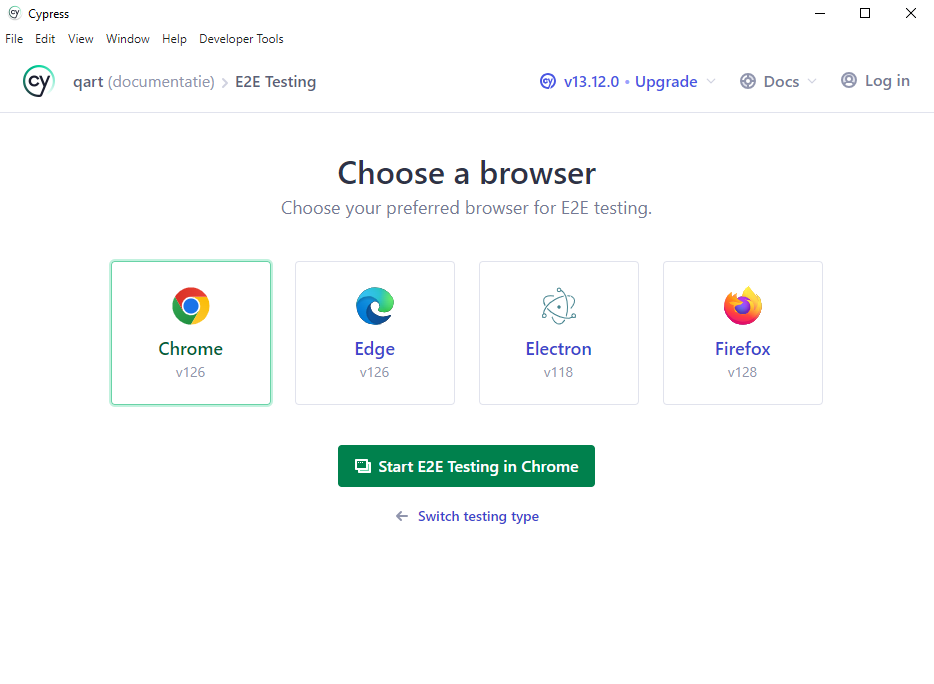

# QART

An automated testframework for function testing of the qalybr.nl website.

## Requirements

You need [node.js](https://nodejs.org/) installed.

## Installation workspace

1. Clone repository
2. Open terminal in ./qart
3. Run `npm ci`

You should now have all node modules to run cypress installed in the project

## Run cypress

1. Open terminal in ./qart
2. Run `npx cypress open`

3. Choose E2E Testing

4. You can now choose your browser and press "Start E2E testing .."

